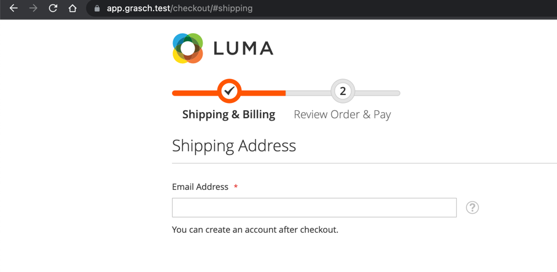

<h1 align="center">grasch/magento-2-ccst</h1>

<div align="center">
  
  <a href="https://GitHub.com/Naereen/StrapDown.js/graphs/commit-activity" target="_blank"></a>
</div>

## Highlight features for module
- <h3>You can change the titles of the checkout steps.</h3>

## How to install module?

### ✓ Install via composer (recommend)

Run the following commands in Magento 2 root folder:

```
composer require grasch/module-ccst
php bin/magento setup:upgrade
php bin/magento setup:static-content:deploy
```
### ✓ Install via downloading

Download and copy files into `app/code/Grasch/Ccst` and run the following commands:
```
php bin/magento setup:upgrade
php bin/magento setup:static-content:deploy
```

## How to configure?
- Go to Stores -> Configuration -> Sales -> Checkout -> Checkout Options -> Steps Config.
- Set up as you need.

### Example


### Result


## The MIT License
[](https://opensource.org/licenses/MIT)

